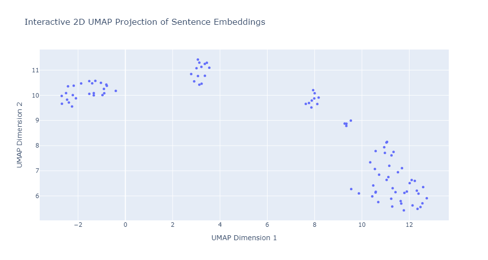
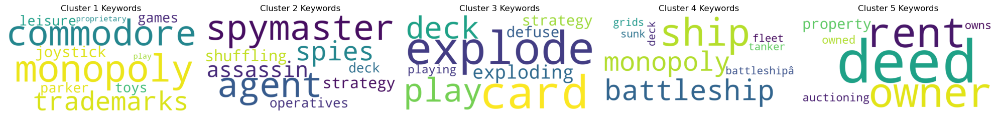

# **Board Game Rules Analysis with LLMs**

## **Project Overview**

This project performs analysis on board game rules using machine learning and language models. It extracts key features from board game rule texts, performs sentence embedding, clustering, and generates visual representations like word clouds. Furthermore, it tests large language models (LLMs), such as **Gemma-7b-it** and **GPT4All**, to answer questions related to the board games' rules.

### **Key Features:**
- **Text Preprocessing:** Board game rules are read and cleaned for further analysis.
- **Sentence Embedding:** Sentences from the rules are embedded using `SentenceTransformer`.
- **Dimensionality Reduction:** UMAP is used to reduce the high-dimensional embeddings to 2D for visualization.
- **Clustering:** KMeans clustering is applied to group similar rule segments together.
- **Word Clouds:** Keywords from clusters are visualized with word clouds using `KeyBERT`.
- **LLM Query Testing:** Test queries are run on Gemma-7b-it and GPT4All models with context from the board game rules.

## **Table of Contents**
1. [Installation](#installation)
2. [Usage](#usage)
3. [Project Structure](#project-structure)
4. [Examples and Visualizations](#examples-and-visualizations)
    - UMAP Projections
    - Word Clouds
    - LLM Responses
5. [Dependencies](#dependencies)

---

## **Installation**

1. Clone the repository:
    ```bash
    git clone https://github.com/Tornadosky/boardgames-rag.git
    cd boardgames-rag
    ```

2. Install dependencies:
    ```bash
    pip install -r requirements.txt
    ```

3. Download necessary data (board game rules) and place them in the `data/` folder:
    ```
    - monopoly.txt
    - battleship.txt
    - ticket_to_ride.txt
    - codenames.txt
    - kittens.txt
    ```

4. Optionally, set up a virtual environment:
    ```bash
    python -m venv venv
    source venv/bin/activate  # On Windows, use `venv\Scripts\activate`
    ```

---

## **Usage**

1. **Run the main script:**
    ```bash
    python src/main.py
    ```

   This will:
   - Load board game rules.
   - Preprocess the text, embed it, and perform dimensionality reduction and clustering.
   - Generate UMAP plots and word clouds for the clusters.
   - Test the Gemma and GPT4All models against predefined queries.

2. **Visualizing the Results:**
   - The UMAP scatter plot of sentence embeddings will be displayed in an interactive Plotly plot.
   - Word clouds for each cluster will be displayed using Matplotlib.
   - Responses from the language models will be printed in the terminal.

---

## **Project Structure**


- **`data/`:** Contains text files with the rules of board games like Monopoly, Battleship, etc.
- **`src/`:** Contains the main logic:
  - `main.py`: Executes the full pipeline: data loading, embedding, clustering, visualizing, and model testing.
  - `utils.py`: Utility functions like loading and formatting the rules.
  - `preprocessing.py`: Handles text preprocessing and sentence embedding.
  - `models.py`: Manages model loading, UMAP, clustering, word cloud generation, and LLM interactions.
- **`requirements.txt`:** List of required Python packages.
- **`.gitignore`:** Files and directories to be ignored by Git.

---

## **Examples and Visualizations**

### **1. UMAP Projection of Sentence Embeddings:**

After embedding the text and reducing dimensions using UMAP, a scatter plot is generated to visualize the sentence chunks from the board game rules. Points are clustered based on their semantic similarity.



- **Visualization:** Each point represents a sentence chunk, and colors denote the clusters assigned by KMeans.

### **2. Word Clouds for Clusters:**

For each cluster of sentence chunks, a word cloud is generated that highlights the most frequent keywords within the cluster, extracted using `KeyBERT`.



- **Visualization:** This showcases the main keywords for a specific cluster.

### **3. LLM Responses:**

The project tests two language models (Gemma-7b-it and GPT4All) by asking them questions about the board game rules and comparing their responses to the ground truth.

- **Example Query:**
    ```plaintext
    Query: "How many agent cards are there for each team in Codenames?"
    ```
  - **Model's Answer:** There are 8 red agent cards and 8 blue agent cards for each team. 
  - **Ground Truth:** There are 8 red agent cards and 8 blue agent cards. 

Both models are tested with a variety of questions to ensure they can accurately retrieve rule-based information.

---

## **Dependencies**

The following packages are used in this project:

- `umap-learn`: For reducing sentence embeddings to lower dimensions.
- `sentence-transformers`: For generating sentence embeddings from board game rules.
- `plotly`: For interactive visualizations like UMAP projections.
- `wordcloud`: For generating word clouds for clusters of rule sentences.
- `keybert`: For extracting keywords from text.
- `spacy`: For preprocessing and splitting sentences.
- `transformers`: For using Gemma-7b-it and GPT4All language models.
- `torch`: For handling tensor operations with the models.
- `numpy`, `pandas`: For data handling and manipulation.
- `scikit-learn`: For performing KMeans clustering.
- `matplotlib`: For generating visual word clouds.
